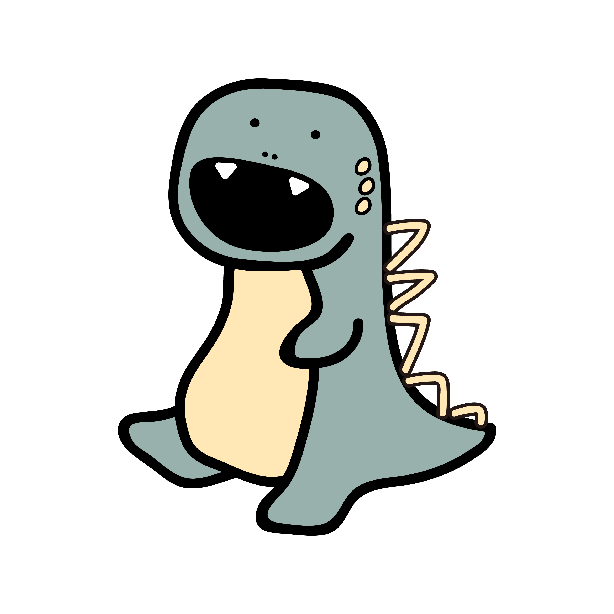
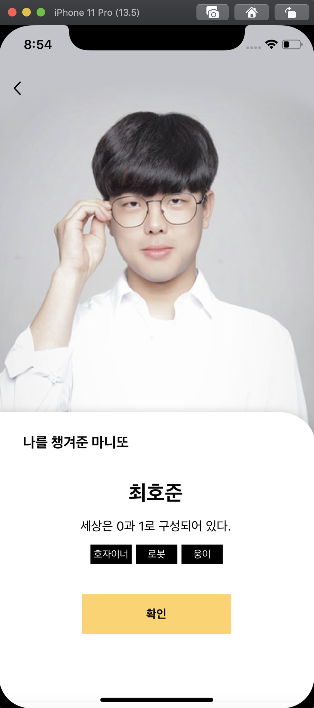

# 👧🏻 DdoDdo-iOS 👧🏻
🦖10어먹조 🍎아요 짱짱맨🍎들의 마니또👧🏻 뽑기 어플리케이션 🦖

 

### 갑작스레 닥쳐온 언택트 시대, 그래도 친구와 정겨운 마니또게임을 즐기고 싶다면!

  

 

#### 🦖🦖 또또와 함께해봐! " 👧🏻🤝👦🏻 "

  

🦕 홈화면 뷰

  

- 자기 프로필과
- 내가 속한 그룹 (현재 진행 중 마니또 그룹과, 완료된 마니또 그룹)이 뜨고
- 새 마니또 버튼으로 그룹을 추가할 수 있다.

 

🦕 선택된 그룹 뷰 (매칭 전)

  

- 홈 화면에서 그룹을 선택하면 그 그룹에 대한 뷰가 푸쉬되는데, 그룹원들의 프로필과 마니또를 매칭할 수 있는 버튼이 있다.
- 마니또 매칭하기 버튼을 누르면 내가 챙겨줘야 할 마니또가 보이는 결과창으로 이동한다.

 

🦕 마니또 매칭 결과 확인 뷰

  

- 내 마니또의 프로필 정보가 보이고 확인버튼으로 통해 뒤로(선택한 그룹정보) 돌아간다.

 

🦕 선택된 그룹 뷰 (매칭 후)

  

- 이미 매칭이 끝난 그룹을 선택하면 그룹원의 프로필, 마니또 공개까지 남은 기간, 내가 챙겨줘야할 마니또의 프로필 정보와 수행해야 할 미션의 체크리스트가 보여진다.
- 홈으로 버튼을 통해 홈으로 돌아갈 수 있다.

 

🦕 완료된 마니또 뷰

  

- 홈화면에서 진행중 마니또가 아닌 완료된 마니또 그룹을 선택하면 나를 챙겨준 마니또의 프로필을 볼 수 있다.
- 확인 버튼을 통해서 뒤로 돌아간다.